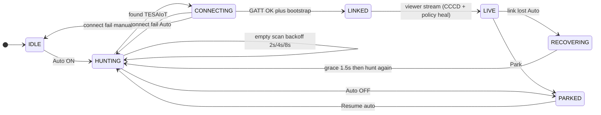
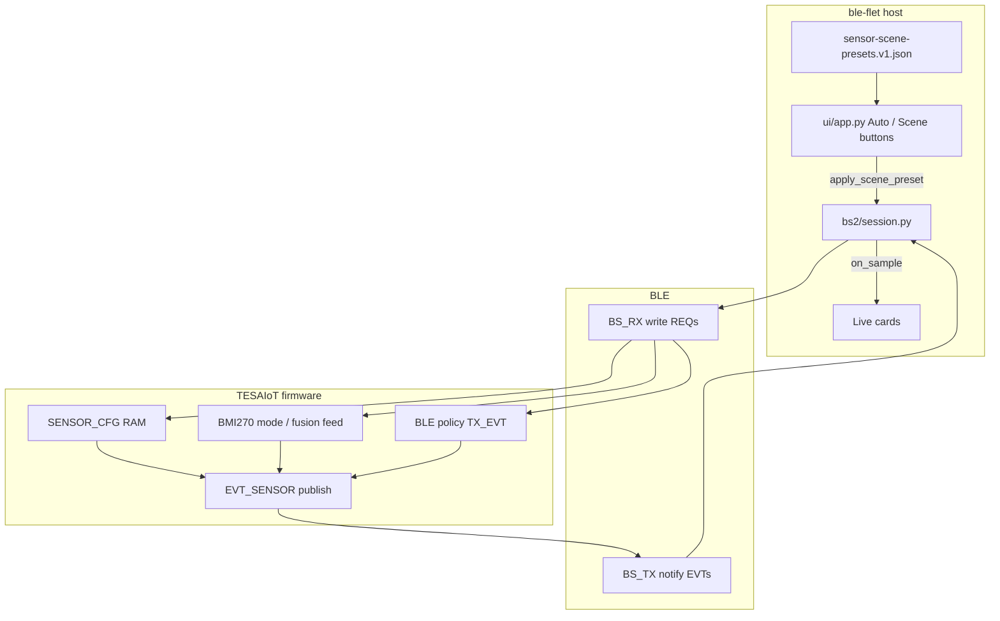
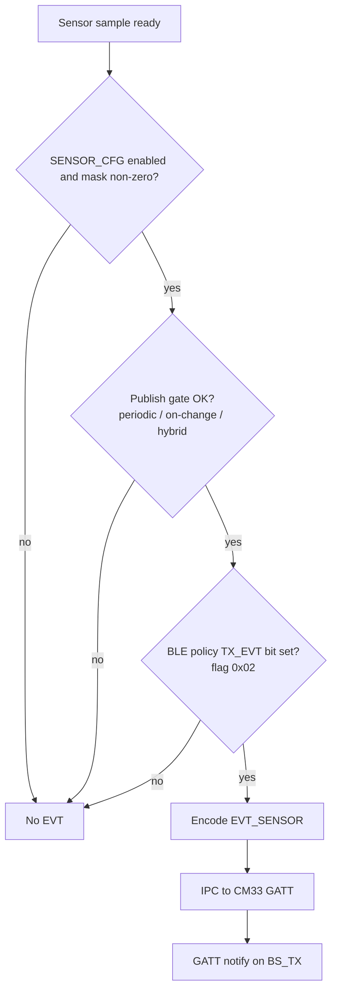
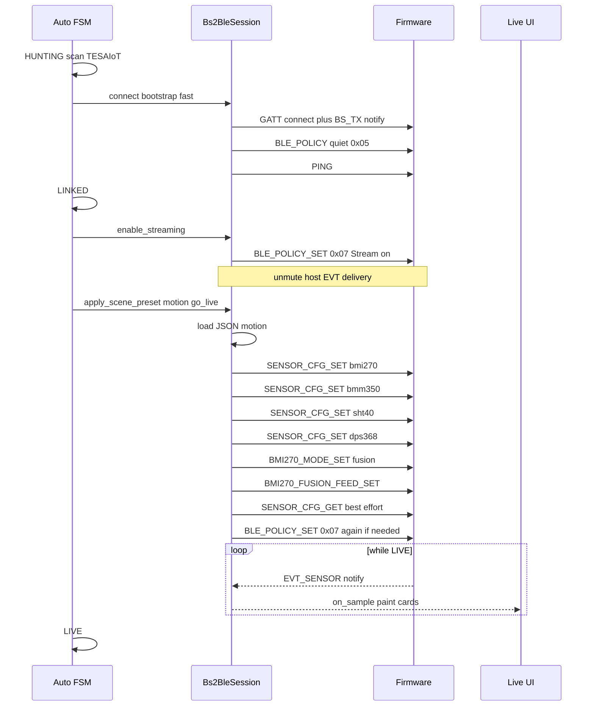

# ble-flet architecture

Desktop **BS2 over BLE** viewer dashboard (Flet + bleak). This document describes how Auto connect, stream heal, and live EVT delivery work together.

## Sensor-node roles

| Role | This app | Firmware |
|------|----------|----------|
| Viewer central | Auto: connect + CCCD + stream — **no** `SENSOR_CFG_SET` | Boot `SENSOR_CFG` defaults drive EVT rate/mask |
| Manual override | Motion / Realtime / Lab Quiet buttons → `apply_scene_preset` | RAM until reboot |
| Configurator (out of band) | Bitstream Studio UART, `python-app` labs | `SENSOR_CFG_GET/SET` as needed |

See [`README.md`](../README.md) for the full wire sequence.

## Overview

1. **Boot defaults** on the MCU define which sensors publish and at what rate.
2. After GATT connect, Auto calls `go_live_on_existing_link()` — CCCD + optional `BLE_POLICY_SET 0x07` heal.
3. Firmware publishes **`EVT_SENSOR`** (CCCD auto-arms `TX_EVT` on current firmware).
4. The app decodes notifies and paints Live cards.

**JSON presets** (`bs2/sensor-scene-presets.v1.json`) are for **manual** scene buttons and `scripts/` only — not Auto connect.

## Key source files

| Path | Role |
|------|------|
| `ui/app.py` | Auto FSM driver, optional scene buttons, viewer go-live |
| `bs2/connection_fsm.py` | `ConnPhase` labels and hunt backoff constants |
| `bs2/session.py` | Bleak session: `connect_as_viewer`, stream heal, optional scene apply |
| `bs2/scene_presets.py` | Load JSON → SENSOR_CFG / BMI270 wire payloads (manual path) |
| `bs2/sensor-scene-presets.v1.json` | Host-authored scene recipes |
| `bs2/wire.py` / `decode.py` / `chunk.py` / `gatt.py` | Framing, UUIDs, EVT mapping |

Auto connect label: `VIEWER_PRESET_LABEL = "device"` (firmware defaults).

---

## Connection state machine

Phases live in `bs2/connection_fsm.py` (`ConnPhase`). The supervisor loop is in `ui/app.py`.



| Phase | Meaning |
|-------|---------|
| **IDLE** | Disconnected; Auto off or waiting |
| **PARKED** | User paused Auto (Park); no hunt |
| **HUNTING** | Scanning for `TESAIoT-*` (backoff `2s → 4s → 8s`) |
| **CONNECTING** | GATT connect + quiet bootstrap |
| **LINKED** | Connected; arming stream (viewer) |
| **LIVE** | Receiving EVT; Live UI updating |
| **RECOVERING** | Link dropped; short grace then hunt again |

Hunt backoff: `HUNT_BACKOFF_S = (2.0, 4.0, 8.0, 8.0)`. Recover grace: `RECOVER_GRACE_S = 1.5`.

---

## Data flow



### What the JSON writes on the wire

| JSON field (per sensor / BMI270) | Wire command |
|----------------------------------|--------------|
| `enabled`, `mask`, intervals, `publishMode`, `deltaX100`, … | `SENSOR_CFG_SET` |
| `bmi270.streamMode` | `BMI270_MODE_SET` |
| `bmi270.fusionFeedIntervalMs` | `BMI270_FUSION_FEED_SET` |

Stream unmute uses **`BLE_POLICY_SET`** (`0x07` factory streaming). That flag is **not** stored as a sensor row in the JSON body.

### UI-only JSON fields (not sent)

`label`, `summary`, `useCases`, `statusLine`, `recommendedBleTelem`, and similar metadata.

### Host vs device mute

- **Device:** BLE policy `TX_EVT` bit controls whether firmware sends EVT over BLE.
- **Host:** `_samples_muted` in `Bs2BleSession` can drop delivery to the UI even if notifies arrive (used briefly while applying some presets). Frame counters may still advance while muted.

---

## When the peripheral notifies

There are **two layers**. Connecting alone is not enough for Live cards.

### 1. Host must subscribe (CCCD)

The central (ble-flet) must enable GATT notifications on **`BS_TX`**:

- Done in `Bs2BleSession.connect` → `start_notify(BS_TX)`
- Without CCCD, the OS BLE stack does not deliver notifies to the app

This only opens the receive pipe. It does **not** mean the firmware is sending sensor data yet.

### 2. When firmware actually sends notifies

Firmware pushes BS2 frames onto BLE (`BS_TX`) only when **all** of these are true:



#### Policy gate (Stream on)

| Policy | Flags | Meaning |
|--------|-------|---------|
| Boot quiet | `0x05` | ADV + accept REQ; **no EVT egress** |
| Streaming | `0x07` | ADV + **TX_EVT** + RX_REQ → EVT may go out |

Boot default is intentional: no sensor flood until the host sends `BLE_POLICY_SET 0x07` (ble-flet **Stream on** / Auto go-live).

Constants (host): `BLE_POLICY_BOOT_DEFAULT = 0x05`, `BLE_POLICY_FACTORY_STREAMING = 0x07` in `bs2/wire.py`. Firmware: `BITSTREAM_BS_BLE_POLICY_*` in the Bitstream BLE policy module.

#### SENSOR_CFG gate (how often)

Per sensor, from the scene JSON / `SENSOR_CFG_SET`:

- **enabled** + **mask**
- **publish_mode**: periodic / on-change / hybrid
- **publishIntervalMs** / **samplingIntervalMs** / **delta** / **minPublishIntervalMs**

Example after **Motion**: BMI270 about every 50 ms (≈20 Hz); env sensors slower.

#### Also required

- BLE central **connected**
- Host CCCD subscribed (section above)
- Telem mode not stopped (orthogonal stop/idle can mute EVT even if policy looks streaming)

### Timeline with ble-flet Auto

| Step | Who | What |
|------|-----|------|
| Connect | Host | GATT connect + `start_notify(BS_TX)` |
| Bootstrap | Host → FW | Quiet policy `0x05` (no EVT) |
| Stream on | Host → FW | Policy `0x07` → **TX_EVT on** → firmware **may notify** |
| Apply Motion | Host → FW | `SENSOR_CFG_SET` / BMI270 → sets **when/how often** each sensor notifies |
| Live | FW → Host | GATT notifies carrying `EVT_SENSOR` (and RES for REQs) |

**RES** (responses to PING / CFG / policy) can also go out on `BS_TX` when the host sends REQs; that path is separate from the continuous sensor stream.

**Short rule:** the peripheral notifies sensor data on **`BS_TX` when `TX_EVT` is on (`0x07`) and each sensor’s publish gate fires** — not merely because you connected.

---

## Sequence: Auto connect → Motion → Live



Manual **Motion / Realtime / Lab Quiet** on the Live page calls the same `apply_scene_preset` path (without the hunt / connect steps).

### Go-live outline (`_connect_and_go_live`)

1. `connect(..., bootstrap="fast")` — quiet policy + PING (no full CFG GET storm).
2. `enable_streaming(refresh_cfg=False)` — best-effort `BLE_POLICY_SET 0x07`.
3. `apply_scene_preset("motion", go_live=True)` — SENSOR_CFG + BMI270 + stream again.
4. Enter **LIVE**, navigate to Live, reset frame counters.

If stream/scene partially fails but EVTs are already flowing (or `TX_EVT` is set), the app still transitions to **LIVE** so the dashboard is not stuck in **LINKED**.

---

## Scene presets

Checked-in recipes: `bs2/sensor-scene-presets.v1.json`.

| Id | Typical use |
|----|-------------|
| `motion` | Default Auto scene — ~20 Hz IMU / fusion-friendly BLE rates |
| `realtime` | Higher / hybrid rates for demos |
| `labQuiet` | Low-rate lab (≈1 Hz) |

Loader: `bs2/scene_presets.py` maps JSON camelCase fields to the host SENSOR_CFG dict used by `set_sensor_cfg`.

---

## Mental model

```text
JSON recipe  →  BLE REQ writes  →  firmware RAM config
                                         ↓
Live cards  ←  EVT_SENSOR notify  ←  publish loop
```

1. JSON is the **host recipe** for rates / masks / BMI270 mode.
2. After connect, Auto pushes **`motion`** into firmware RAM.
3. Firmware publishes EVT according to that config.
4. The app displays what arrives on `BS_TX` until you apply another scene.

---

## Related

- App runbook: [`../README.md`](../README.md)
- Host BS2 protocol (Bitstream Studio): `extension/docs/BS2_PROTOCOL_INDEX.md` (in the Bitstream-Studio monorepo)
