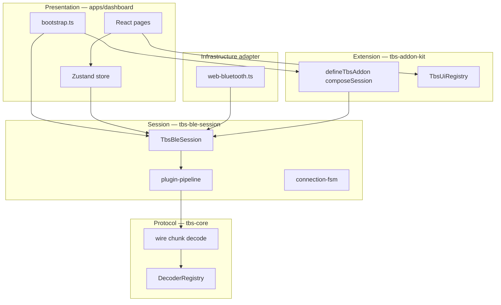
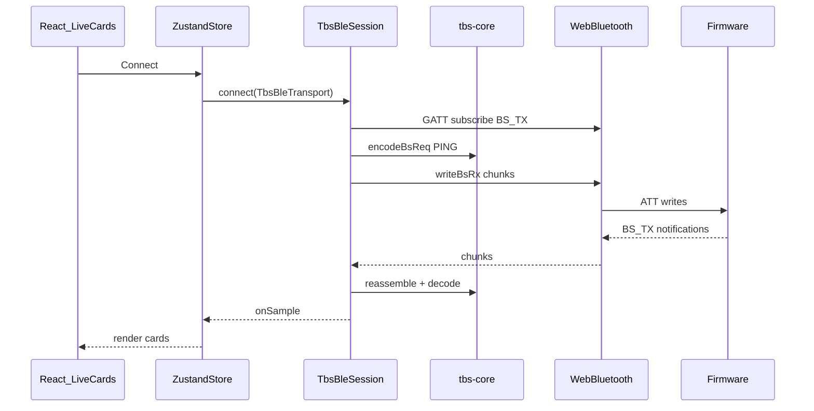
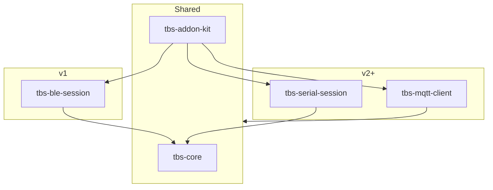

# Architecture — ble-react / `@ternion/tbs-*`

**Version:** 0.1  
**Date:** 2026-07-11

---

## 1. Design goals

1. **Separate protocol from transport** — `tbs-core` knows what bytes mean; BLE/Serial/MQTT packages know how they move.
2. **Publishable libraries** — `packages/` compile to npm; `apps/` is a demo consumer only.
3. **Extension without forking** — `defineTbsAddon`, registries, and UI slots.
4. **BLE first, multi-transport later** — same `SensorSample` and add-on hooks across paths.

---

## 2. Naming: BS2, TBS, BLE

| Term | Layer | Example |
|------|-------|---------|
| **BS2** | Wire protocol (spec) | `encodeBsReq`, `EVT_SENSOR`, `BS2_BLE_SERVICE_UUID` |
| **TBS** | npm product / public API | `@ternion/tbs-core`, `TbsBleSession`, `defineTbsAddon` |
| **BLE** | v1 radio path only | `@ternion/tbs-ble-session`, `web-bluetooth.ts` |

Do **not** rename BS2 wire identifiers in code — they must match firmware and Bitstream Studio.

---

## 3. Layer model



### Layer rules

| Layer | Package / path | May import | Must not import |
|-------|----------------|------------|-----------------|
| L1 Protocol | `@ternion/tbs-core` | — | sibling packages, React, `navigator` |
| L2 Session | `@ternion/tbs-ble-session` | `tbs-core`, `tbs-addon-kit` (types) | React, `navigator.bluetooth` |
| Extension | `@ternion/tbs-addon-kit` | `tbs-core`, `tbs-ble-session` | dashboard app |
| L3 Transport | `apps/.../transport/web-bluetooth.ts` | `tbs-ble-session`, `tbs-core` | BS2 parse logic (delegate to session/core) |
| L4 UI | `apps/dashboard` | all workspace packages | — |

---

## 4. Repository layout

```text
ble-react/
├── pnpm-workspace.yaml
├── package.json
├── README.md
├── docs/
│   ├── REQUIREMENTS.md
│   ├── ARCHITECTURE.md          # this file
│   ├── IMPLEMENTATION_PLAN.md
│   └── ADDONS.md
├── packages/
│   ├── tbs-core/                # @ternion/tbs-core
│   ├── tbs-ble-session/         # @ternion/tbs-ble-session
│   ├── tbs-addon-kit/           # @ternion/tbs-addon-kit
│   └── tbs-example-led/         # @ternion/tbs-example-led
└── apps/
    └── dashboard/               # @ternion/tbs-dashboard-demo (private)
```

---

## 5. Package responsibilities

### 5.1 `@ternion/tbs-core` (protocol)

**Responsibility:** BS2 encode/decode; ATT chunk envelope; shared types; decoder registry.

| Module | Contents |
|--------|----------|
| `gatt.ts` | Locked service/characteristic UUIDs |
| `chunk.ts` | `encodeBs2BleChunks`, `Bs2BleChunkReassembler` |
| `wire.ts` | `encodeBsReq`, frame parse, CRC16-CCITT |
| `commands.ts` | cmdIds, `BLE_POLICY_*` flags |
| `decode-sensor.ts` | EVT_SENSOR, SENSOR_CFG bodies |
| `decode-link.ts` | BS_LINK snapshot |
| `rate.ts` | Authoritative meas Hz (counter ÷ `deviceMs`) |
| `scene-presets.ts` | Load `sensor-scene-presets.v1.json` |
| `registry.ts` | `DecoderRegistry` extension point |
| `transport.ts` | `TbsFrameTransport` port (frame byte pipe) |

**Port (frame transports — BLE + future Serial):**

```ts
interface TbsFrameTransport {
  connect(): Promise<void>;
  disconnect(): Promise<void>;
  writeFrame(frame: Uint8Array): Promise<void>;
  subscribeFrames(onFrame: (frame: Uint8Array) => void): Promise<() => void>;
}
```

BLE wraps this with chunking inside `TbsBleTransport`.

### 5.2 `@ternion/tbs-ble-session` (BLE orchestration)

**Responsibility:** Connect lifecycle, REQ/RES, stream policy, EVT dispatch, add-on pipeline.

| Module | Contents |
|--------|----------|
| `session.ts` | `createTbsBleSession`, `TbsBleSession` |
| `transport.ts` | `TbsBleTransport` (GATT-level port) |
| `plugin-pipeline.ts` | Ordered `TbsSessionPlugin` hooks |
| `connection-fsm.ts` | Phases: idle → linked → live |
| `builtins/` | `registerBuiltinSensors()` first-party add-on |

**Session events (non-React):**

```ts
type SessionEvents = {
  onPhase: (phase: ConnPhase) => void;
  onSample: (sensorId: SensorId, sample: SensorSample) => void;
  onLink: (snap: LinkSnapshot) => void;
  onLog: (level: "info" | "warn" | "error", msg: string) => void;
};
```

### 5.3 `@ternion/tbs-addon-kit` (extensions)

**Responsibility:** `defineTbsAddon`, `composeSession`, mixins, React UI registry.

| Export | Role |
|--------|------|
| `defineTbsAddon` | Factory for third-party packages |
| `validateTbsAddon` | Bootstrap guard |
| `composeSession` | Wrap session factory with add-ons |
| `withSessionHooks` | Mixin helper |
| `TbsUiRegistry` | Routes, sensor cards, link panels, toolbar |
| `TbsAppShell` | Reference layout (react export) |
| `TBS_EXTENSION_API_V1` | Contract version constant |

### 5.4 `apps/dashboard` (reference consumer)

Thin React app — **not** the framework. Single composition root in `bootstrap.ts`:

```ts
const addons = [registerBuiltinSensors(), registerLedAddon()];
const session = composeSession(createTbsBleSession, addons);
const ui = createUiRegistry();
addons.forEach((a) => a.ui?.(ui));
```

---

## 6. Data flow (BLE v1)



---

## 7. Multi-transport roadmap



| Transport | Package | Wire | Uses `tbs-core` framer? |
|-----------|---------|------|-------------------------|
| BLE | `tbs-ble-session` | BS2 in ATT chunks | Yes |
| Web Serial | `tbs-serial-session` | Raw BS2 @ 921600 | Yes |
| MQTT | `tbs-mqtt-client` | JSON on broker topics | Partial — map to `SensorSample` |

**MQTT port (future):**

```ts
interface TbsMqttTransport {
  connect(brokerUrl: string): Promise<void>;
  subscribe(topic: string, onMessage: (payload: string | Uint8Array) => void): Promise<void>;
  publish(topic: string, payload: string | Uint8Array): Promise<void>;
  disconnect(): Promise<void>;
}
```

Add-on `onSample` hooks stay unchanged when MQTT normalizes to `SensorSample`.

---

## 8. BLE GATT quick reference

| Item | Value |
|------|--------|
| Service | `6f6b7a80-0001-4000-8000-00805f9b34fb` |
| BS_RX | `...4001...` (central → device) |
| BS_TX | `...4002...` (device → central, notify) |
| BS_LINK | `...4003...` (read / notify) |
| Adv name | `TESAIoT-<MAC4>` |
| Chunk header | 6 bytes: ver, flags, seq u16, idx, total |
| Stream policy | `BLE_POLICY_SET` flags `0x07` |

Full spec: Bitstream Studio `BLE_BS2.md`.

---

## 9. Build and publish

| Path | Published | Output |
|------|-----------|--------|
| `packages/tbs-core` | Yes | `dist/` ESM + CJS + `.d.ts` (tsup) |
| `packages/tbs-ble-session` | Yes | same |
| `packages/tbs-addon-kit` | Yes | same + `/react` export |
| `packages/tbs-example-led` | Optional | same |
| `apps/dashboard` | No | Vite static build |

Publish: `pnpm -r --filter './packages/*' publish --access public` (requires `@ternion` npm org).

---

## 10. Testing strategy

| Layer | Tool | Scope |
|-------|------|-------|
| `tbs-core` | Vitest | CRC goldens, chunk reassembly, EVT decode, registry |
| `tbs-ble-session` | Vitest | Fake transport, PING, policy SET encode path |
| `tbs-addon-kit` | Vitest | `composeSession` hook order, `validateTbsAddon` |
| Dashboard | Manual | Web Bluetooth + real DevKit smoke |

---

## 11. Sync with Bitstream-Studio (avoid drift)

| Artifact | Action |
|----------|--------|
| GATT UUIDs, chunk format | Copy into `tbs-core`; optional `scripts/sync-bs2-constants.sh` |
| Scene presets JSON | Copy from `ble-flet/bs2/sensor-scene-presets.v1.json` |
| BLE cmdIds / flags | Port constants from `extension/.../domains/ble/commands.ts` |

**Never** add `Bitstream-Studio/extension` as an npm dependency of published packages.

---

## 12. Technology stack

| Concern | Choice |
|---------|--------|
| Language | TypeScript strict |
| Monorepo | pnpm workspaces |
| Library build | tsup |
| App bundler | Vite |
| UI | React 19 |
| State | Zustand + XState (connection FSM) |
| Styles | Tailwind (app-local) |
| Unit tests | Vitest |
| BLE (v1) | Web Bluetooth API |

---

## 13. Related documents

- [REQUIREMENTS.md](./REQUIREMENTS.md)
- [IMPLEMENTATION_PLAN.md](./IMPLEMENTATION_PLAN.md)
- [ADDONS.md](./ADDONS.md)
